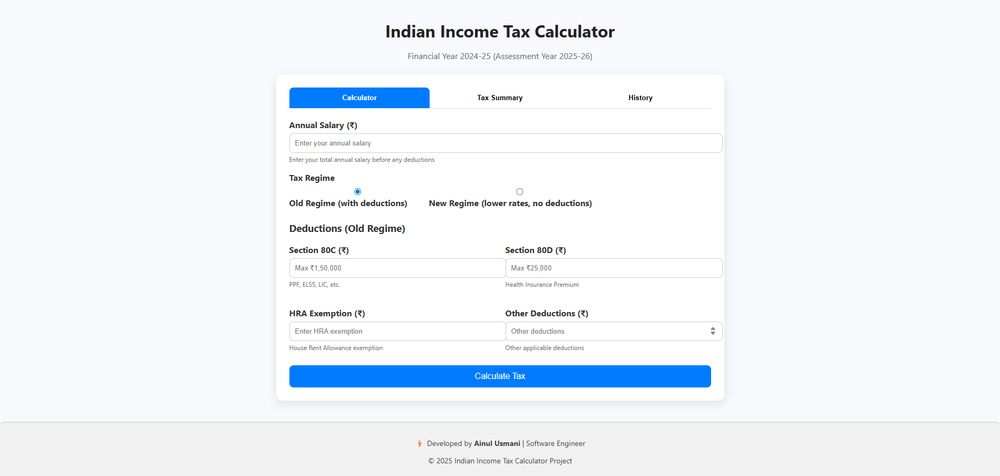

# 📊 Indian Income Tax Calculator  


A modern **Indian Income Tax Calculator** built using **HTML, CSS, and JavaScript**.  
Easily calculate your income tax for **FY 2024-25 (AY 2025-26)** under both **Old Regime (with deductions)** and **New Regime (lower rates, no deductions)**.  

👉 **[💻 Live Demo on Vercel](https://indian-income-tax-calculator.vercel.app/)**  

---

## 🚀 Features  

- ⚡ **Modern UI** – Clean & responsive design.  
- 📊 **Tax Regime Selection** – Old Regime vs New Regime.  
- 💸 **Deductions Input** – Section 80C, 80D, HRA & Other deductions.  
- 🧾 **Tax Summary Tab** – Shows salary, taxable income, tax & cess.  
- 📜 **History Tab** – Save and view past calculations.  
- 🛡️ **Rebate u/s 87A** and **4% Health & Education Cess** auto-applied.  
- 🖥️ Runs directly in your browser – No installation required.  
- 📝 **Created with ❤️ by Ainul Haq**.  

---

## 🖼️ Preview  

  

---

## 🛠️ How to Use  

1. **Enter your Annual Salary (₹)**.  
2. **Select Tax Regime:**  
   - Old Regime → Add deductions (80C, 80D, HRA, Other).  
   - New Regime → Lower rates, no deductions.  
3. Click **Calculate Tax**.  
4. View detailed **Tax Summary**.  
5. Track past results in the **History tab**.  

---

## ⚙️ Installation & Usage  

1. Clone the repo:
   ```bash
   git clone https://github.com/iamainul/indian-income-tax-calculator.git
   cd indian-income-tax-calculator
